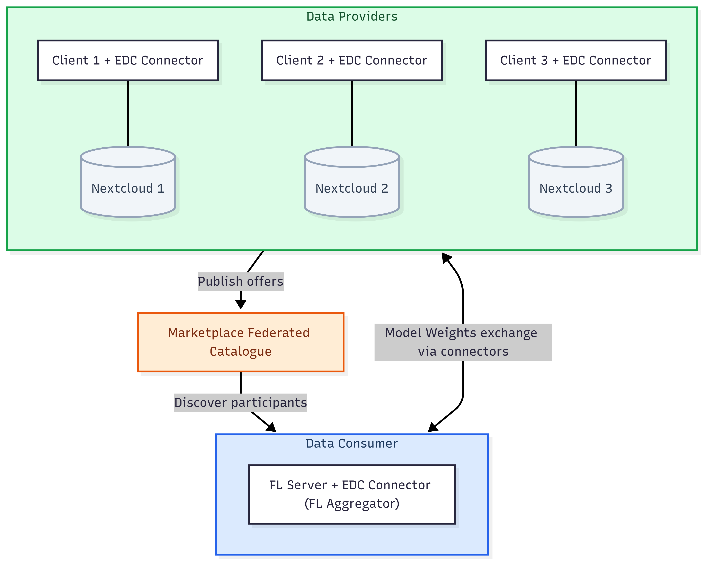

# Federated Learning with Data Spaces and NS-3 Network Simulation

This research focuses on evaluation the communication overhead of using Data Spaces layer for model weight exchnage of Federated Learning. We use EDC as Data Space implementation, Nextcloud as extension to EDC for file storage, and NS-3 to simulate realistic network conditions.

# Key Features
  - Data Space Layer: EDC connectors and Nextcloud for sovereign model exchange.
  - Federared Learning Implementation with model exhange through EDC or direct HTTP.
  - CNN model for image classification on MNIST/Fashion-MNIST dataset.
  - NS-3 integration to simulate network conditions for communication overhead.


  
## Repository Structure

```
├── configs/
│   ├── flFactors.json
│   ├── datasetFactors.json
│   ├── networkingFactors.json
│   ├── dataSpaceFactors.json
│   └── edc/
│   └── resources/
├── dataset_utils/
│   ├── prepare_dataset.py
│   ├── split_data.py
│   └── upload_to_nextcloud.py
├── dataspace/
│   ├── connector_config.py
│   ├── edc-ionos-nextcloud-extension
│   ├── edc_negotiation.py
│   ├── edc_utils.py
│   ├── marketplace/
│   ├── nextcloud_utils.py
├── fedLearning/
│   ├── fl_server.py
│   ├── fl_client.py
│   ├── models.py
│   └── utils/
│       ├── fl_aggregation.py
│       ├── fl_server_utils.py
│       ├── fl_edc_utils.py
│       ├── fl_server_trainer.py
│       ├── fl_client_trainer.py
│       ├── fl_utils.py
│       ├── config_utils.py
│       └── metrics_collector.py
├── ns3-fl-network/
├── docker-compose.yml
├── start_fl.py
└── requirements.txt
```

## Setup

### 1. Python Environment
```bash
pip install -r requirements.txt
```

### 2. Build Docker Images
```bash
# EDC connector image
cd dataspace
chmod +x ./gradlew
./gradlew clean build
docker build -t edc-ionos-nextcloud:1.0 .
cd ..

# FL + NS3 images
docker-compose build
```

### 3. Prepare Dataset
Downloads dataset.
```bash
python dataset_utils/prepare_dataset.py
```

## Running an Experiment

`start_fl.py` is the single entry point. It:
1. Splits the dataset for the configured number of clients
2. Sets NS-3 environment variables
4. Starts only the Docker services needed (scales with `num_clients`)
5. In `with-edc` mode: waits for the marketplace web app and publishes client offers
6. Starts the training in FL loop with transfer through EDC depending on the mode in config file.

```bash
python3 start_fl.py
```

## How it works

### With-EDC mode

Here we introduce the **Data Space layer using EDC + Nextcloud**.

- Each client has its **own EDC connector and its own Nextcloud storage**.
- The Research Centre (RC) also has its **own EDC connector and Nextcloud**.

Model exchange now happens through **EDC-managed transfers**:

- **RC → Client (global model)**  
  The client acts as the **EDC consumer**.  
  Its connector initiates a `Nextcloud-PUSH` transfer.  
  This triggers the RC connector to **push `global_weights.pkl` as a filetransfer into the client’s Nextcloud**.

- **Client → RC (trained model)**  
  The RC acts as the **EDC consumer**.  
  Its connector initiates a `Nextcloud-PUSH` transfer.  
  This triggers the client connector to **push `{client_id}_weights.pkl` as a filetransfer into the RC’s Nextcloud**.

### Without-EDC mode

In this mode the model weights are exchanged directly between clients and the server via GET/POST requests:

- Clients train locally and send their model weights directly in the HTTP `submit_update` request.
- The server aggregates and sends back the updated global model in the `get_model` response.

### Aggregation Strategies

| Strategy | Config value | Behaviour |
|---|---|---|
| FedAvg (sync) | `"aggregation": "fedavg"` + `"mode": "sync"` | Wait for all clients each round, then aggregate |
| FedAsync | `"aggregation": "fedasync"` or `"mode": "async"` | Aggregate immediately on each client update |

## References :

- EDC-Nextcloud extension: https://github.com/Digital-Ecosystems/edc-ionos-nextcloud
- NS3-FL : https://github.com/eekaireb/ns3-fl